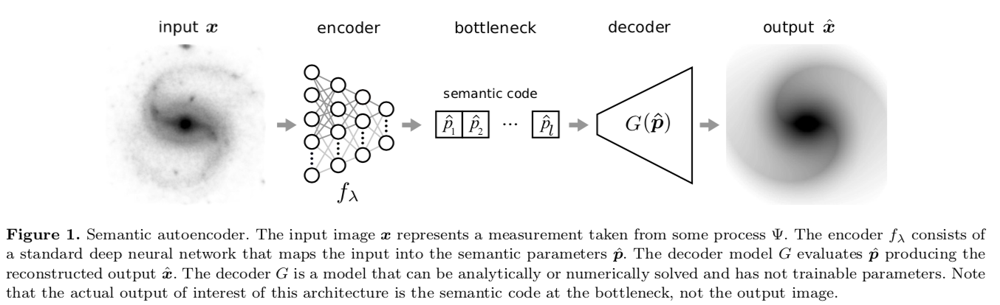
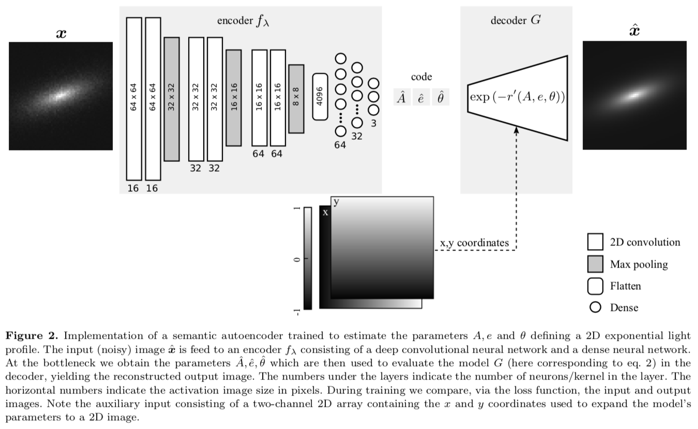
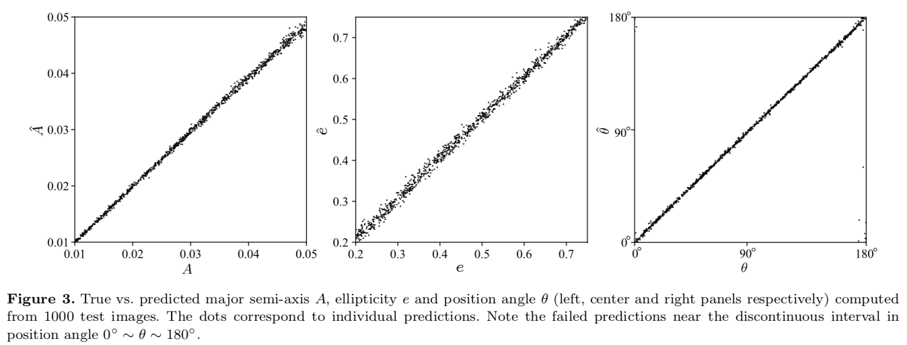
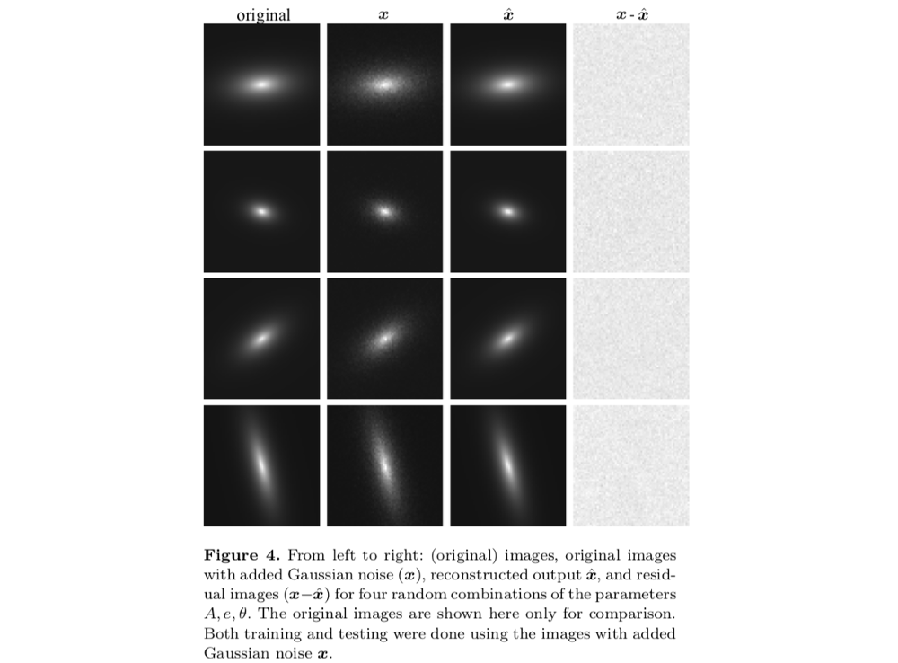

# Code for the paper: Self-supervised Learning with Physics-aware Neural Networks I: Galaxy Model Fitting

[Get the paper here](https://arxiv.org/abs/1907.03957)

***
***

### The main idea is to replace the decoder in an autoencoder by a model defined by a set of semantic parameters produced by the encoder.

***

### This is the actual implementation. Note that we inject the coordinates as two-dimensional arrays.

***

### The semantic autoencoder can predict the scale, ellipticity and angle of the exponential profile.

***

### A visual representation of the predicted parameters

