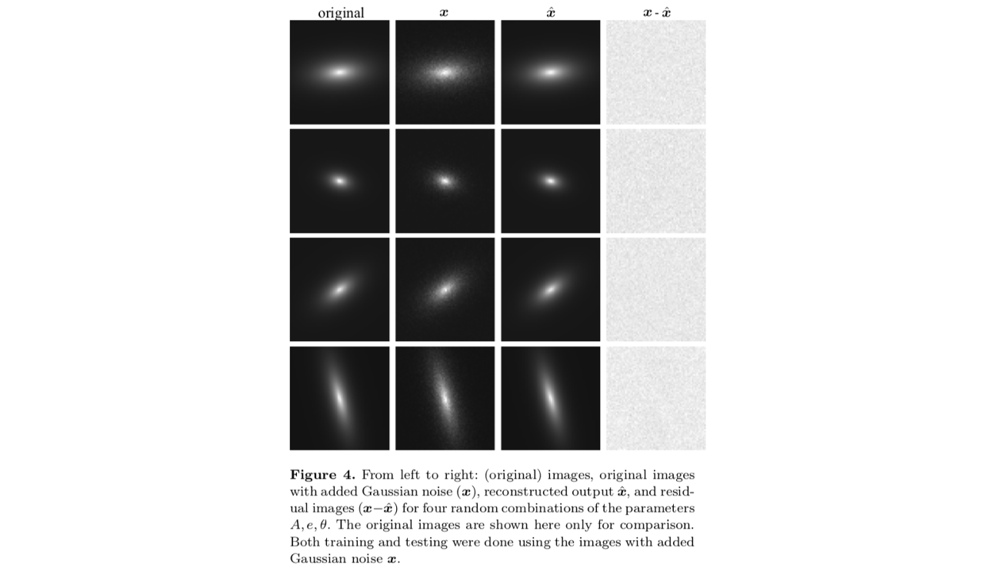

## Self-supervised Learning with Physics-aware Neural Networks I: Galaxy Model Fitting

[Get the paper here](https://arxiv.org/abs/1907.03957)

***
***

The main idea of the paper is to replace the decoder in an autoencoder by a model defined by a set of semantic parameters produced by the encoder.The encoder produces parameters that correspond to paramters of the model in the decoder. This way we don't need supervision during training. Instead the model in the decoder will generate new images based on the predicted parameters.

***

This is the actual implemented architecture. Note that we inject the coordinates as two-dimensional arrays.

***

So after training the semantic autoencoder can predict the scale, ellipticity and angle of the exponential profile to a very good degree.

***

Finally we can see a visual comparison between true and predicted images.

***

This work was partly funded by “Programa de Apoyo a Proyectos de Investigacion e Innovacion Tecnologica” grant DGAPA-PAPIIT IA104818

